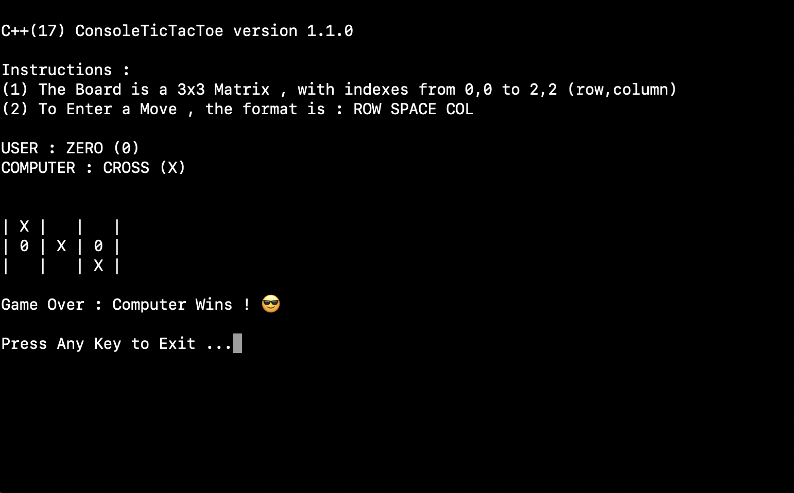

# C++ Console TicTacToe

This is a single player C++ Console TicTacToe Game that you can play with the computer.  
In this game, you can never win against the computer — either the computer will win or the game will be drawn.

---

## Screenshot

---

## Building the Project

1. Download the code  
2. Create a `build` folder within the downloaded folder  
3. Run `make ConsoleTicTacToe` to build the project  
4. A file named `ConsoleTicTacToe.exe` (on Windows) or `ConsoleTicTacToe` (on macOS) will be created  
